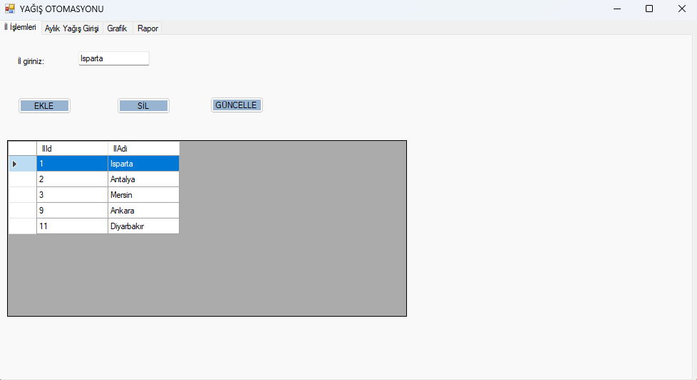
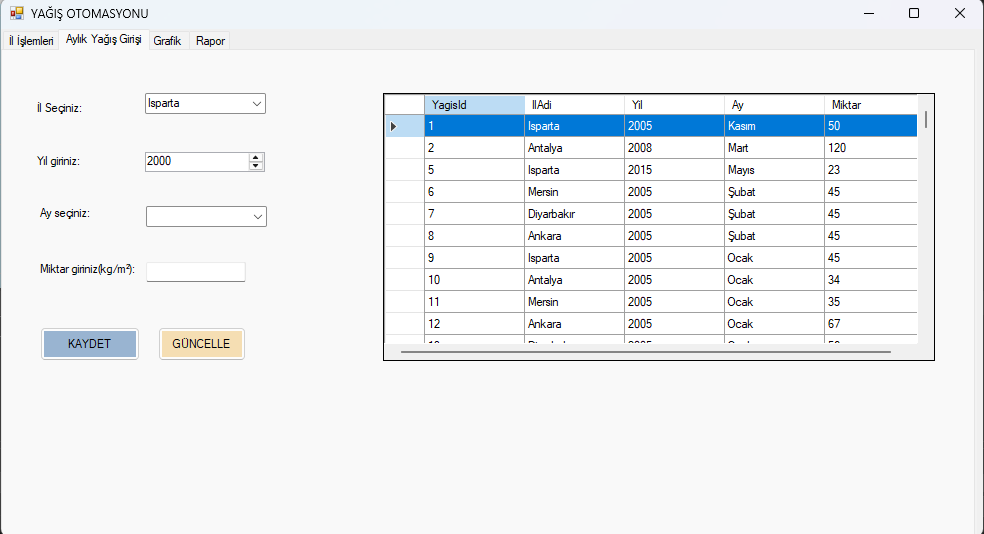
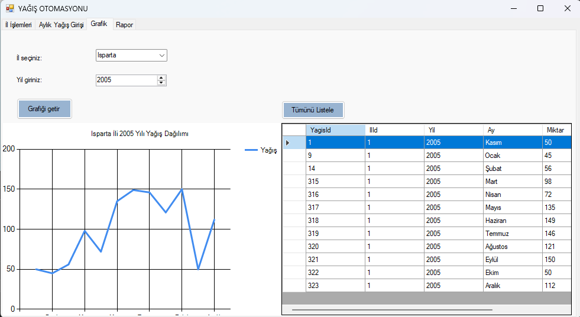
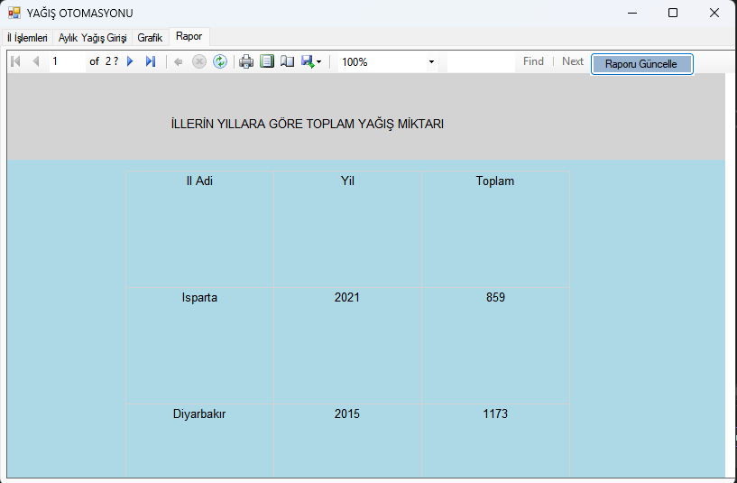

# Yağış Verisi Yönetim ve Görselleştirme Sistemi

C# WinForms kullanılarak geliştirilmiş, şehir ve yıla göre yağış verilerinin
yönetilmesini ve analiz edilmesini sağlayan masaüstü uygulaması.

## 📌 Proje Açıklaması
Bu uygulama, yağış verilerinin düzenli bir şekilde saklanmasını, filtrelenmesini
ve grafiklerle görselleştirilmesini amaçlamaktadır.

Veri tabanı işlemleri, kullanıcı etkileşimi ve raporlama süreçlerini içeren
eğitim amaçlı bir projedir.

## 🚀 Özellikler
- Yağış verisi ekleme, silme, güncelleme ve listeleme
- Şehir ve yıla göre filtreleme
- Grafiklerle yağış analizi
- ReportViewer ile raporlama
- SQL Server veritabanı kullanımı

## 🛠 Kullanılan Teknolojiler
- C#
- .NET WinForms
- SQL Server
- Entity Framework (Database First)
- LINQ
- Chart Kontrolleri
- ReportViewer

## 🗄 Veritabanı
Projede SQL Server kullanılmıştır.
CRUD işlemleri Entity Framework ve LINQ ile gerçekleştirilmiştir.

## 📊 Görselleştirme
Yağış verileri grafikler aracılığıyla görselleştirilerek
yıllara ve şehirlere göre analiz edilmiştir.

## ⚠️ Notlar
- Proje eğitim amaçlıdır.
- Çalıştırmadan önce veritabanı bağlantı ayarlarının yapılması gerekir.

## 📸 Ekran Görüntüsü

